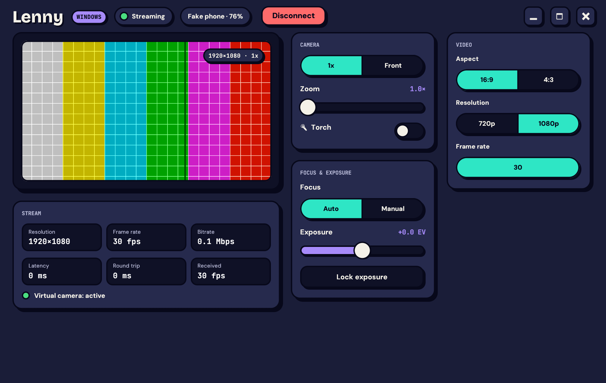
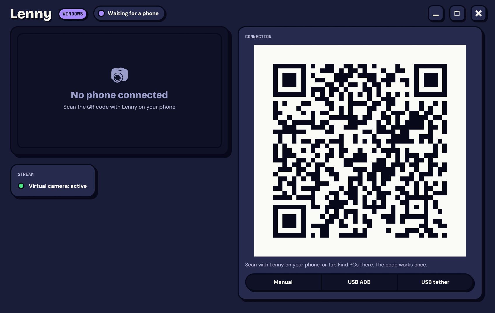
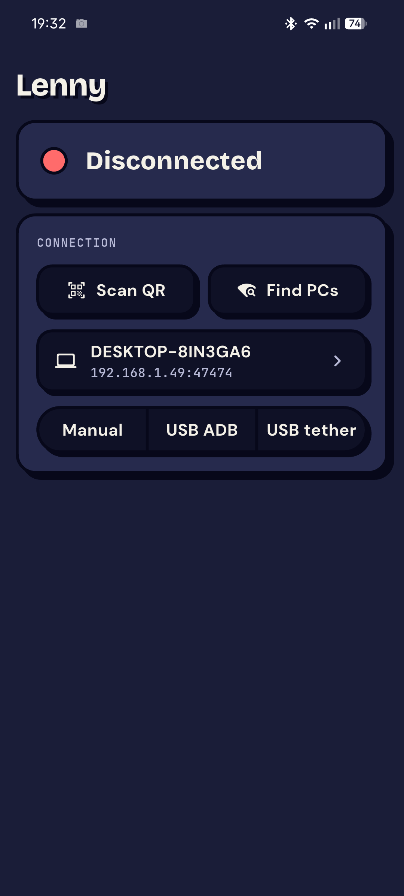

# Lenny

Use your phone as a webcam. The phone app streams its camera to the Lenny desktop app over Wi-Fi, and
the desktop app is where you pick the camera, resolution, frame rate, focus and exposure.

<p align="center">
  
</p>

<p align="center">
  
  &nbsp;
  
</p>

## Status

Version 1.0. **Android phone → Windows 10/11 PC** works end to end, including the virtual camera other apps see. The core
and the desktop app are Rust (ADR-0006, ADR-0007); the phone app is still Flutter for now.

What works today:

- **Virtual camera "Lenny"** on Windows: a DirectShow camera (Windows 10 and 11) and a Media Foundation one (Windows 11),
  tested with Edge/Chrome (getUserMedia) and OpenCV. Zoom, Teams, Discord and OBS in a real call: not tried yet.
- Live H.264 over Wi-Fi, USB tethering or USB (adb), around 30 ms on 5 GHz Wi-Fi or a cable.
- Connecting: scan the QR code on the PC, tap *Find PCs*, or type the address. Phones you allowed once reconnect by
  themselves, also after sleep, app switches or a PC restart.
- Camera control from the PC: lens (0.6× / 1× / 2× / front, whatever the phone has), zoom, pan where the phone allows
  it, focus Auto or tap to focus, exposure and exposure lock, torch.
- Aspect, resolution (up to 4K) and frame rate (up to 60 fps on phones with high-speed video), from what each lens
  really supports, switched live.
- Phone name and battery on the PC.

Not there yet: OBS plugin, iOS phone app, Linux on a real v4l2loopback (built, only tested with a null camera),
encryption. macOS is out of scope.

Testing notes live in [docs/testing.md](docs/testing.md). The wire protocol is at 1.1 ([protocol.md](docs/protocol.md) §11).

## Try it

Get `Lenny-Setup-<version>.exe` (Windows) and `Lenny-Android.apk` from the [Releases](../../releases) page.

1. Install the phone app, run the Windows installer (it asks for admin once: camera, background service, firewall rule)
   and open Lenny on the PC.
2. On the phone, tap **Scan QR** and point it at the code on the PC (or **Find PCs**). Phone and PC need the same
   network, or USB tethering.
3. The first time, allow the phone on the PC.
4. In Zoom / Teams / Discord / the browser, pick the camera **Lenny**.

Uninstall from Windows Settings → Apps. Files a running app still holds (the camera DLL) go at the next restart.

## Build

Needs Flutter (stable), Android Studio (SDK + NDK), Rust (stable) with the Android targets and cargo-ndk, and, for
Windows, Visual Studio 2022 with the C++ workload.

```sh
rustup target add aarch64-linux-android armv7-linux-androideabi x86_64-linux-android i686-linux-android
cargo install cargo-ndk
```

```sh
cd app
flutter build apk --release        # app/build/app/outputs/flutter-apk/app-release.apk
flutter build appbundle --release  # app/build/app/outputs/bundle/release/app-release.aab
```

Windows desktop + installer (needs NSIS and `rustup target add i686-pc-windows-msvc` for the 32-bit camera DLL):

```powershell
powershell -File installer\build.ps1   # target\Lenny-Setup-<version>.exe
```

Core library tests (Rust; the Android build runs cargo-ndk for you):

```sh
cargo test --workspace
core/tools/abi_check.sh   # the Rust core still exports exactly include/lenny/lenny.h (needs cbindgen, clang)
```

Linux desktop (Rust, same app):

```sh
cargo run --release -p lenny_desktop                     # the app; falls back to a null virtual camera without v4l2loopback
sudo modprobe v4l2loopback exclusive_caps=1 card_label=Lenny   # for a real /dev/videoN other apps can open
cargo run -p lenny_desktop --example fake_phone -- 127.0.0.1 47474   # no phone at hand
```

## How it's built

| Part | What |
| --- | --- |
| `core/` | Rust library shared by every platform: protocol, sessions, pairing, clock sync. C ABI (`include/lenny/lenny.h`). |
| `desktop/` | Rust desktop app (egui), Windows and Linux. |
| `vcam/` | Virtual camera behind one trait: Windows shared-memory writer, v4l2loopback on Linux, a null backend. |
| `vcam/com/` | The Windows camera DLL (DirectShow filter + Media Foundation source), Rust, x64 and x86. |
| `framebuf/` | The shared-memory frame ring between the app and the camera DLL. |
| `installer/` | NSIS installer and uninstaller (ADR-0008). |
| `app/` | Flutter phone app (Android). Its old Windows desktop UI is being retired. |
| `plugins/android_camera` | Camera2 capture + MediaCodec H.264 encoder (Kotlin + JNI). |

More: [architecture](docs/architecture.md), [wire protocol](docs/protocol.md), [design system](docs/design.md), [testing](docs/testing.md).
